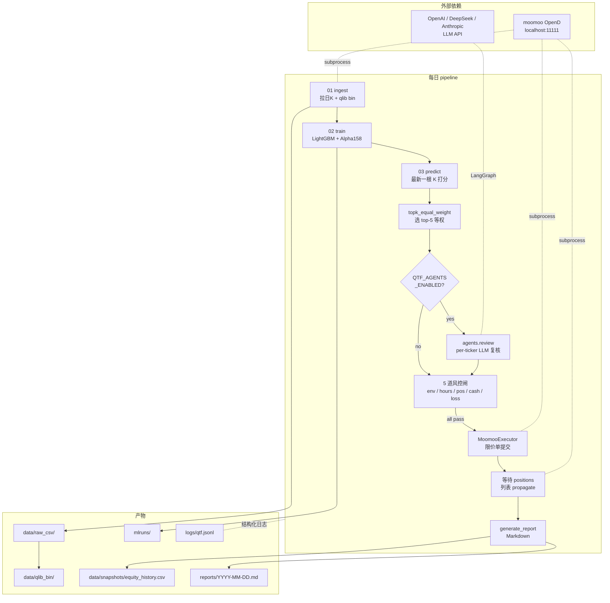
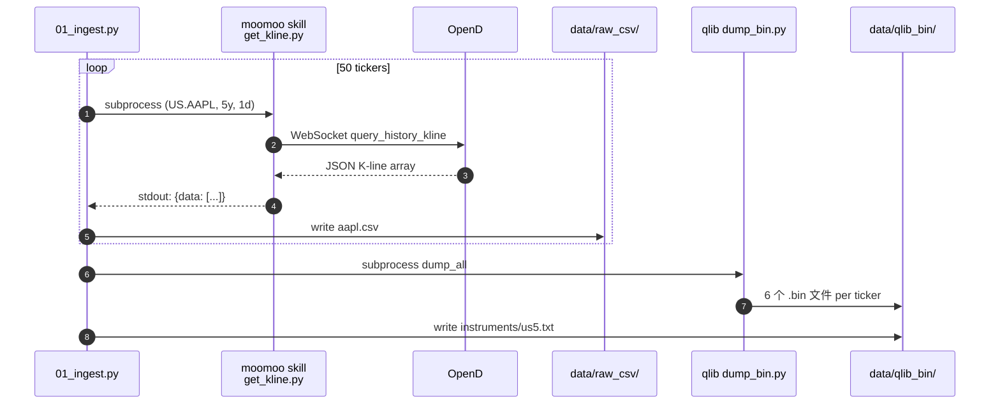
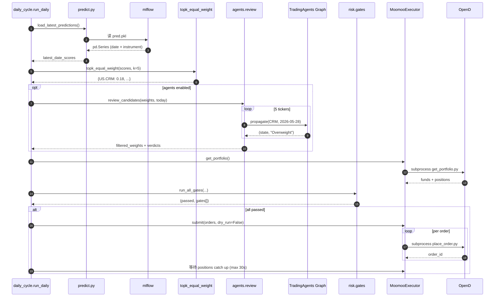

# 系统架构

## 总览



## 6 层模块

```
src/qtf/
├── utils/         共享 utility（subprocess 包装、JSON 日志）
├── data/          数据层
├── model/         模型训练
├── strategy/      选股 + 权重
├── agents/        TradingAgents LLM 复核（可选）
├── execution/     订单规划 + moomoo executor
├── risk/          5 道风控闸
├── backtest/      历史回测引擎 + 指标（夏普/回撤/IC）
├── report/        快照 + 指标 + Markdown 渲染
└── orchestrator/  daily_cycle 串联所有层
```

> 注：`backtest/` 是**离线评估工具**，不在每日 pipeline 里（每日跑的是实盘流程）。
> 它独立运行 `scripts/06_backtest.py`，用历史预测评估策略选股质量，
> 替代了 qlib 自带的 PortAnaRecord（后者在美股配置下不可用且会触发 joblib teardown 崩溃）。

每层职责严格隔离，便于单测和替换：

| 层 | 关键文件 | 输入 | 输出 |
|----|---------|------|------|
| data | `moomoo_kline.py` / `ingest.py` | 票池、日期范围 | `data/qlib_bin/` |
| model | `train.py` | qlib YAML | mlflow run + `pred.pkl` |
| strategy | `predict.py` / `topk_weights.py` | mlflow predictions | `{code: weight}` dict |
| agents | `review.py` | top-K weights + date | filtered weights + verdicts |
| execution | `order_planner.py` / `moomoo_executor.py` | weights + current portfolio | Order list / submit results |
| risk | `gates.py` / `market_hours.py` | orders + portfolio | (passed, [GateResult]) |
| report | `snapshot.py` / `metrics.py` / `daily_report.py` | cycle_result + history | `reports/YYYY-MM-DD.md` |

## 数据流

### 拉数据 → qlib bin



### 模型 → 选股 → 执行



## 配置 / 状态

| 类型 | 位置 | 提交? |
|------|------|------|
| 不变配置 | `configs/*.yaml` / `*.txt` | ✓ |
| 凭据 | `.env` | ✗（gitignored）|
| 模板 | `.env.example` | ✓ |
| 拉到的数据 | `data/raw_csv/` / `data/qlib_bin/` | ✗ |
| 训练产物 | `mlruns/` | ✗ |
| 快照 | `data/snapshots/equity_history.csv` | ✗ |
| 报告 | `reports/*.md` | ✗ |
| 日志 | `logs/qtf.jsonl` | ✗ |

## 子进程 + JSON 通信约定

所有 moomoo skill 调用都通过 [`src/qtf/utils/subprocess_runner.py`](../src/qtf/utils/subprocess_runner.py) 的 `run_skill(category, name, *args)`：

```python
payload = run_skill(
    "quote", "get_kline",
    "US.AAPL", "--ktype", "1d",
    "--start", "2025-01-01", "--end", "2025-05-28",
)
# payload = {"code": "US.AAPL", "data": [...]}
```

`--json` 标志自动加。skill 必需的 `FUTU_*` 环境变量从 `qtf.config.settings` 自动注入。

## 日志规范

所有运行时事件用 `qtf.utils.logging.log_event()` 写到：

- **stdout**（实时可见）
- **`logs/qtf.jsonl`**（结构化 JSON，每行一个事件）

事件命名：`<phase>.<step>[.<status>]`，例：
- `cycle.predict` / `cycle.scores` / `cycle.weights`
- `cycle.agents.review` / `agents.review.verdict` / `agents.review.done`
- `cycle.risk` / `cycle.aborted`
- `report.snapshot.captured` / `report.daily.written`

便于离线 grep / 复盘 / 接告警。
