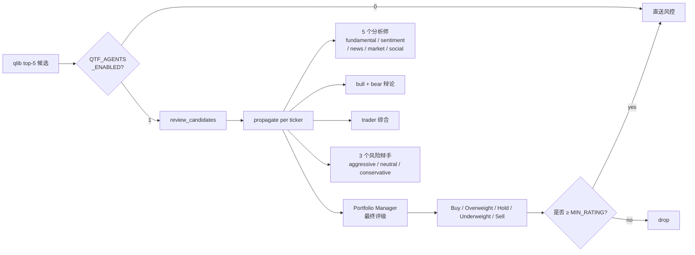

# TradingAgents LLM 复核层

qtf 把 qlib 当成**廉价快速排序器**，把 TradingAgents 当成**定性深度复核**——量化与定性结合的折中方案。

## 工作原理



每只候选股触发**完整 12 次 LLM 调用**（5 个分析师 + 2 个研究员 + 1 个交易员 + 3 个风险辩手 + 1 个 PM）。

## 决策过程示例

某次复核 US.CRM 的 PM 最终决议（节选）：

> **Rating**: Overweight
>
> **Executive Summary**: 对 CRM 的最终决策为 Overweight：维持偏多判断，但执行上采用分批而非追高。建议较基准权重增加约 2%-4% 的主动暴露，分 2-3 批在回调企稳或放量站稳关键价位时加仓；若放量跌破前低支撑，则暂停加仓并按 Hold 节奏管理。
>
> **Investment Thesis**: 我给 CRM 的最终评级是 Overweight，而不是 Buy，核心原因是多头在基本面上占优，但空头对"增长斜率重估"和"确认度不足"的提醒也不能忽视。支持偏多的证据非常明确：CRM 本季交出超预期业绩，Q1 EPS 3.88 美元、营收... [省略 600 字]

完整理由会写入 `reports/YYYY-MM-DD.md` 的"多 Agent 复核结果"区块，便于事后审阅模型判断对不对。

## 配置项

[`.env`](../.env.example) 里所有 `QTF_AGENTS_*` 和 `TRADINGAGENTS_*`：

```dotenv
# --- qtf 侧开关 ---
QTF_AGENTS_ENABLED=1           # 总开关；0 = 跳过 LLM 复核
QTF_AGENTS_MIN_RATING=Overweight  # 保留门槛: Buy | Overweight | Hold | ...
QTF_AGENTS_FAIL_OPEN=1         # LLM 报错时: 1=保留候选, 0=丢弃

# --- TradingAgents 侧 provider ---
TRADINGAGENTS_LLM_PROVIDER=openai   # openai/anthropic/google/deepseek/qwen/glm/azure/ollama
TRADINGAGENTS_DEEP_THINK_LLM=gpt-5.4       # 深度思考（trader/PM）
TRADINGAGENTS_QUICK_THINK_LLM=gpt-5.4-mini # 快速思考（分析师/辩手）
TRADINGAGENTS_LLM_BACKEND_URL=             # 自定义网关 URL（DeepSeek/Azure 等用）
TRADINGAGENTS_MAX_DEBATE_ROUNDS=1          # 多空辩论轮数
TRADINGAGENTS_MAX_RISK_ROUNDS=1            # 风险辩论轮数
TRADINGAGENTS_OUTPUT_LANGUAGE=中文          # English / 中文 / 日本語 ...

# --- provider API keys（按选用的 provider 填一个即可）---
OPENAI_API_KEY=sk-...
ANTHROPIC_API_KEY=
DEEPSEEK_API_KEY=
GOOGLE_API_KEY=
```

## Provider 切换示例

### OpenAI（默认）

```dotenv
TRADINGAGENTS_LLM_PROVIDER=openai
TRADINGAGENTS_DEEP_THINK_LLM=gpt-5.4
TRADINGAGENTS_QUICK_THINK_LLM=gpt-5.4-mini
OPENAI_API_KEY=sk-proj-...
```

成本：~$0.20-0.50/天（5 只票 × 12 次调用，深思考用 gpt-5.4 浅思考用 mini）。

### DeepSeek（最便宜）

```dotenv
TRADINGAGENTS_LLM_PROVIDER=deepseek
TRADINGAGENTS_DEEP_THINK_LLM=deepseek-chat
TRADINGAGENTS_QUICK_THINK_LLM=deepseek-chat
TRADINGAGENTS_LLM_BACKEND_URL=https://api.deepseek.com
DEEPSEEK_API_KEY=sk-...
```

成本：~$0.01-0.05/天，质量略次于 GPT-5.4 但仍可用。

### Anthropic Claude

```dotenv
TRADINGAGENTS_LLM_PROVIDER=anthropic
TRADINGAGENTS_DEEP_THINK_LLM=claude-opus-4-7
TRADINGAGENTS_QUICK_THINK_LLM=claude-haiku-4-5
ANTHROPIC_API_KEY=sk-ant-...
```

金融分析能力 frontier 级，成本中等。

### 本地 Ollama

```dotenv
TRADINGAGENTS_LLM_PROVIDER=ollama
TRADINGAGENTS_DEEP_THINK_LLM=qwen3:32b
TRADINGAGENTS_QUICK_THINK_LLM=qwen3:7b
TRADINGAGENTS_LLM_BACKEND_URL=http://localhost:11434
```

免费，但需要本地 30+ GB 显存才能跑大模型，且金融任务质量明显次于云端。

## 失败模式

| 场景 | `FAIL_OPEN=1`（默认）| `FAIL_OPEN=0` |
|------|----------------------|----------------|
| LLM 超时 | 保留候选，继续下单 | 丢弃候选 |
| API key 未配置 | 保留所有候选，等于关闭 agents | 丢弃所有候选，pipeline 卡住 |
| 单只票 propagate 出错 | 该只票保留，其余正常 | 该只票丢弃，其余正常 |
| LangGraph 内部异常 | 保留所有候选 | 丢弃所有候选 |

**推荐**：保持 `FAIL_OPEN=1`。LLM 是辅助层，不应该因为云服务波动卡住整条 pipeline。

## 实际效果

启用 agents 后，[`reports/YYYY-MM-DD.md`](../reports/) 会多出一节：

```markdown
## 多 Agent 复核结果

### ✅ US.CRM — Overweight
> [PM 完整中文理由]

### ✅ US.ORCL — Overweight
> [理由]

### ❌ US.NVDA — Hold（dropped）
> [理由：模型给的高分但 agent 认为短期估值已透支...]
```

- ✅ 表示通过门槛、加入最终下单清单
- ❌ 表示被 LLM 否决，不会下单

## 成本管控

如果想让 LLM 调用更少：

1. **降 debate 轮数**：`TRADINGAGENTS_MAX_DEBATE_ROUNDS=0` 会跳过 bull/bear 辩论（省 2 次调用/票）
2. **改用便宜的 quick model**：所有非关键 agent 都改 mini 版本
3. **调高 k 时把 min_rating 也调高**：top-10 但只要 Buy 级别，多调用但严格筛选
4. **缓存命中**：TradingAgents 自带 `~/.tradingagents/cache/` —— 同一只票同一天不重复跑，所以**不要在同一天反复 trigger**（每天一次即可）

## 何时关掉 agents

- 想要纯量化基线（看 qlib 单独表现）
- 没有 API key / 没预算
- 跑回测，每天 60 次 LLM 调用 × 100 天 = 6000 次太贵

直接 `.env` 里 `QTF_AGENTS_ENABLED=0`，qlib 出的 top-5 直送风控，零成本。
